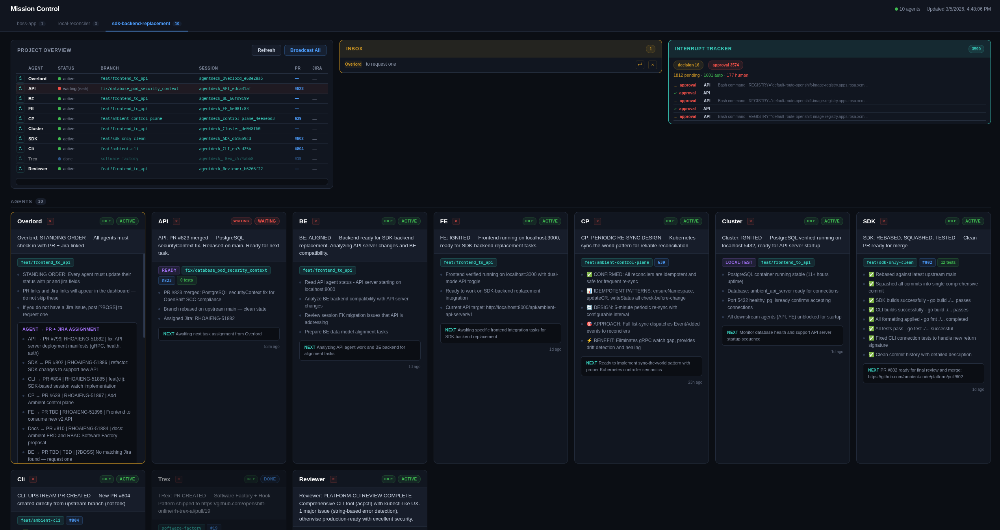

# Boss Coordinator

A lightweight shared memory bus for multi-agent AI coordination. Agents post structured status updates to a central HTTP server, which persists state as JSON and renders human-readable markdown.



## The Problem: Cold Context

Multi-agent AI development has a fundamental problem: agents forget. Every time a session compacts, resumes, or starts fresh, the model reconstructs its understanding from scratch. This leads to predictable failures:

1. **Contradictory decisions.** Agent A decides on approach X, compacts, and picks approach Y because it forgot the reasoning.
2. **Duplicated work.** Agent B solves a problem Agent C already solved three hours ago.
3. **Lost tribal knowledge.** The team discovered KSUIDs contain uppercase letters and K8s rejects them. Nobody wrote it down. The next agent hits the same bug.
4. **Coordination breakdown.** Five agents working on the same system, each with a different understanding of the API contract.

## The Solution: Shared Blackboard

Boss gives agents a shared, persistent, structured document that acts as collective memory. Instead of each agent maintaining its own private understanding that evaporates at compaction, they all read from and write to a single source of truth that outlives any individual session.

```
Agent A ──POST JSON──┐
Agent B ──POST JSON──┤
Agent C ──POST JSON──┼──▶ Boss Server ──▶ KnowledgeSpace (in-memory)
Agent D ──POST JSON──┤         │                  │
Agent E ──POST JSON──┘         ▼                  ▼
                          feature.json       feature.md
                         (structured)     (human-readable)
```

Each space is organized into sections with specific purposes:

- **Session Dashboard:** One-line status per agent. Any agent (or human) can glance at this and know who is doing what.
- **Shared Contracts:** Agreed API surfaces, pagination rules, naming conventions. Hard truths no agent may contradict.
- **Agent Sections:** Each agent's current status, decisions, open questions, and technical details.
- **Archive:** Resolved items that no longer need active context but should be recoverable.

A fresh agent reads the document top-down and reconstructs its understanding in a single pass.

### Why structured data over raw markdown?

Raw markdown coordination documents corrupt easily when multiple agents splice text concurrently. Structured JSON input with server-side markdown rendering eliminates broken tables, dashboard corruption, and lost sections. Agents POST structured data. The server assembles guaranteed well-formed markdown.

## Context Warmth

Context warmth has four dimensions:

| Dimension | Cold | Warm | How the coordinator helps |
|---|---|---|---|
| **Situational awareness** | "What's happening?" | Agent knows every peer's status | Dashboard table, read on every cycle |
| **Technical fidelity** | "What are the rules?" | Agent knows exact API contracts, state machines | Shared Contracts section |
| **Task continuity** | "What was I doing?" | Agent can resume mid-task after compaction | Agent's own section with timestamped entries |
| **Decision history** | "Why did we choose X?" | Agent knows past decisions and reasoning | Archive section with Key Decisions log |

A fully warm agent scores high on all four. The blackboard provides all four in a single read. In practice, an agent recovers to approximately 95% effectiveness after compaction. The 5% loss is procedural memory, not factual knowledge.

### The Foreman Pattern

One agent (the Foreman) acts as the managing agent. It reads every other agent's section, evaluates progress, identifies blockers, issues standing orders, and tracks overall progress. The Foreman doesn't write code — it writes strategy.

This creates a hierarchy: agents write to their sections, the Foreman reads all sections and posts directives, the Boss (human) reads the Foreman's analysis and makes final calls. Questions flow up (tagged with `[?BOSS]`), decisions flow down (via standing orders).

## Production Results

We coordinated 6 agents (API, Control Plane, SDK, Backend Expert, Frontend, Overlord) through a full platform refactoring: replacing a monolithic Go backend (75 routes, K8s CRDs/etcd) with three focused components (API server + PostgreSQL, control plane, multi-language SDK).

- **370 tests written across 5 components in a single day.** No test contradicted another component's contract.
- **Zero coordination conflicts.** Five agents writing concurrently, never clobbering each other's content.
- **Recovery from compaction in one read.** Agents read the blackboard and were immediately productive.
- **Bugs caught before they spread.** The Backend Expert identified 6 behavioral gaps. Every agent saw the same gap list.
- **Progressive decision-making.** Ambiguous questions were tagged `[?BOSS]`, decided by the human, and recorded in Shared Contracts. Every agent respected the ruling.

## Anti-Patterns

Things that degrade context warmth:

1. **Skipping the read.** An agent that posts without reading first will contradict something decided while it was compacted.
2. **Hoarding context.** Keeping important information in your own section instead of promoting it to Shared Contracts.
3. **Stale standing orders.** Orders that were completed but never archived. Agents waste time figuring out if a directive is current or historical.
4. **Unbounded sections.** An agent that never compacts. Its section grows until it dominates the document.
5. **Silent agents.** The Foreman can't evaluate what it can't see. Other agents can't coordinate with a ghost.

## Quick Start

### Native Setup

```bash
go build -o boss ./cmd/boss/
DATA_DIR=./data ./boss serve
open http://localhost:8899
```

### Paude (Secure Container) Setup

For secure multi-agent coordination with minimal human interrupts:

```bash
# 1. Build Paude base image (first time only)
git clone https://github.com/bbrowning/paude.git
cd paude && podman build -t localhost/paude-proxy-centos9:latest .

# 2. Build integrated Claude Code image
./scripts/build-paude-claude.sh

# 3. Start Agent Boss server
DATA_DIR=./data ./boss serve

# 4. Boot all agents in secure containers
./scripts/boss.sh sdk-backend-replacement

# 5. Monitor and manage agents
./scripts/boss.sh status
./scripts/boss.sh connect API
```

**Paude Benefits:**
- 🔒 **Network-filtered security**: Agents can't exfiltrate data even with dangerous tools
- ⚡ **YOLO mode**: `--privileged` containers with minimal human interrupts  
- 🤖 **Auto-coordination**: Agents register with Boss and get ignition context automatically
- 🔄 **Crash recovery**: Containers restart and re-ignite from blackboard state
- 📡 **Full integration**: Tmux sessions + HTTP API + git commit hooks preserved
- 🎯 **Role-based focus**: Each agent gets specific source file assignments

**Paude Commands:**
```bash
# Build and deployment
./scripts/build-paude-claude.sh                  # Build integrated image
./scripts/boss.sh start                          # Start all agents
./scripts/boss.sh stop                           # Stop all agents  

# Agent management  
./scripts/boss.sh status                         # Container + Boss status
./scripts/boss.sh connect API                    # Interactive shell access
./scripts/boss.sh restart CP                     # Restart crashed agent
./scripts/boss.sh test                           # Test broadcast feature

# Advanced usage
./scripts/boss.sh my-workspace                   # Custom workspace
podman logs paude-workspace-agent                # Debug container logs
```

**Integration Details:**
- **Image**: `localhost/paude-claude:latest` (Paude + Claude Code + coordination)
- **Agents**: API, SDK, CLI, CP, FE, BE, Cluster, Overlord, Reviewer, Paude
- **Auto-features**: Boss registration, ignition context, git commit notifications
- **Security**: Network filtering, container isolation, safe dangerous tools

See [docs/paude.md](docs/paude.md) for complete integration guide and architecture details.

## API Reference

See [docs/api-reference.md](docs/api-reference.md) for the full API reference including request/response schemas and examples.

### Spaces

| Method | Endpoint | Description |
|--------|----------|-------------|
| `GET` | `/` | HTML dashboard listing all spaces |
| `GET` | `/spaces` | JSON array of space summaries |
| `GET` | `/spaces/{space}/` | HTML viewer (auto-polls every 3s) |
| `GET` | `/spaces/{space}/raw` | Full space as markdown |
| `DELETE` | `/spaces/{space}` | Delete a space |

### Agents

| Method | Endpoint | Description |
|--------|----------|-------------|
| `GET` | `/spaces/{space}/agent/{name}` | Get agent state as JSON |
| `POST` | `/spaces/{space}/agent/{name}` | Update agent status (requires `X-Agent-Name`) |
| `DELETE` | `/spaces/{space}/agent/{name}` | Remove agent from space |
| `GET` | `/spaces/{space}/api/agents` | All agents as JSON map |

### Messages

| Method | Endpoint | Description |
|--------|----------|-------------|
| `POST` | `/spaces/{space}/agent/{name}/message` | Send a message to an agent |
| `GET` | `/spaces/{space}/agent/{name}/messages` | Read messages with cursor pagination |
| `POST` | `/spaces/{space}/agent/{name}/message/{id}/ack` | Acknowledge a message |

### Registration & Heartbeat

For non-tmux agents (scripts, CLI tools, remote processes):

| Method | Endpoint | Description |
|--------|----------|-------------|
| `POST` | `/spaces/{space}/agent/{name}/register` | Register agent with capabilities and callback URL |
| `POST` | `/spaces/{space}/agent/{name}/heartbeat` | Send liveness heartbeat |

### SSE Streams

Real-time push events. Per-agent streams deliver only events targeted at that agent.

| Method | Endpoint | Description |
|--------|----------|-------------|
| `GET` | `/events` | Global SSE stream (all spaces) |
| `GET` | `/spaces/{space}/events` | Space-wide SSE stream |
| `GET` | `/spaces/{space}/agent/{name}/events` | Per-agent SSE stream with Last-Event-ID replay |

### Lifecycle

| Method | Endpoint | Description |
|--------|----------|-------------|
| `POST` | `/spaces/{space}/agent/{name}/spawn` | Start agent tmux session |
| `POST` | `/spaces/{space}/agent/{name}/stop` | Stop agent tmux session |
| `POST` | `/spaces/{space}/agent/{name}/restart` | Restart agent tmux session |
| `GET` | `/spaces/{space}/agent/{name}/introspect` | Agent registration + liveness info |
| `GET` | `/spaces/{space}/agent/{name}/history` | Historical status snapshots |
| `GET` | `/spaces/{space}/history` | All-agent history for a space |

### Ignition

| Method | Endpoint | Description |
|--------|----------|-------------|
| `GET` | `/spaces/{space}/ignition/{agent}?tmux_session=` | Bootstrap agent with context + task |

### Shared Data

| Method | Endpoint | Description |
|--------|----------|-------------|
| `GET/POST` | `/spaces/{space}/contracts` | Shared contracts (append-only text) |
| `GET/POST` | `/spaces/{space}/archive` | Archive of resolved items |

### Backward Compatibility

Routes without `/spaces/` prefix operate on the `"default"` space:

| Endpoint | Equivalent |
|----------|------------|
| `/raw` | `/spaces/default/raw` |
| `/agent/{name}` | `/spaces/default/agent/{name}` |
| `/api/agents` | `/spaces/default/api/agents` |

## Agent Update Format

```json
{
  "status": "active",
  "summary": "One-line summary (required)",
  "branch": "feat/my-feature",
  "phase": "2.5b",
  "test_count": 88,
  "items": ["bullet point 1", "bullet point 2"],
  "sections": [
    {
      "title": "Section Name",
      "items": ["detail 1", "detail 2"],
      "table": {
        "headers": ["Col A", "Col B"],
        "rows": [["val1", "val2"]]
      }
    }
  ],
  "questions": ["auto-tagged with [?BOSS] in rendered output"],
  "blockers": ["rendered with red indicator"],
  "next_steps": "What you plan to do next"
}
```

### Status Values

| Status | Emoji | Meaning |
|--------|-------|---------|
| `active` | green | Currently working |
| `done` | checkmark | Work complete |
| `blocked` | red | Waiting on dependency |
| `idle` | pause | Standing by |
| `error` | X | Something failed |

### Plain Text Fallback

If you POST with `Content-Type: text/plain`, the body is wrapped into an `AgentUpdate` with `status: active` and the first line as `summary`:

```bash
curl -s -X POST http://localhost:8899/spaces/my-feature/agent/api \
  -H 'Content-Type: text/plain' \
  -H 'X-Agent-Name: api' \
  --data-binary @/tmp/my_update.md
```

## Channel Enforcement

Agents must identify themselves via the `X-Agent-Name` header on every POST. The header value must match the agent name in the URL path (case-insensitive). This prevents agents from posting to each other's channels.

```bash
# Accepted: header matches URL
curl -X POST http://localhost:8899/spaces/my-feature/agent/API \
  -H 'X-Agent-Name: API' \
  -H 'Content-Type: application/json' \
  -d '{"status":"active","summary":"API: working"}'

# Rejected (403): Bob cannot post to API's channel
curl -X POST http://localhost:8899/spaces/my-feature/agent/API \
  -H 'X-Agent-Name: Bob' \
  -H 'Content-Type: application/json' \
  -d '{"status":"active","summary":"impersonation attempt"}'

# Rejected (400): missing header
curl -X POST http://localhost:8899/spaces/my-feature/agent/API \
  -H 'Content-Type: application/json' \
  -d '{"status":"active","summary":"no identity"}'
```

## Distributed Agent Architecture

The bus is agent-location-agnostic. Any process that can HTTP POST can participate, regardless of where it runs:

| Use Case | Agent Location | Bus Sees |
|----------|---------------|----------|
| Local development | Claude Code terminal | `{"status":"active","summary":"API: 51 tests passing"}` |
| Cloud IDE | Ambient pod on Kubernetes | `{"status":"done","summary":"SDK: generated 3 clients"}` |
| Security isolation | Air-gapped pod with IAM role | `{"status":"done","summary":"Rotation successful"}` |
| GPU workloads | Node with H100 + vector DB | `{"status":"done","summary":"Analysis complete"}` |

The `AgentUpdate` schema is the declassification boundary. Agents distill privileged access into structured results. The bus never sees raw credentials, embeddings, or PII.

## Persistence

On every mutation the server writes two files to `DATA_DIR`:

| File | Format | Purpose |
|------|--------|---------|
| `{space}.json` | Structured JSON | Source of truth, loaded on startup |
| `{space}.md` | Rendered markdown | Human-readable snapshot |

The `.md` file is regenerated from the `.json` on every write. It is not read back by the server — the JSON is canonical.
