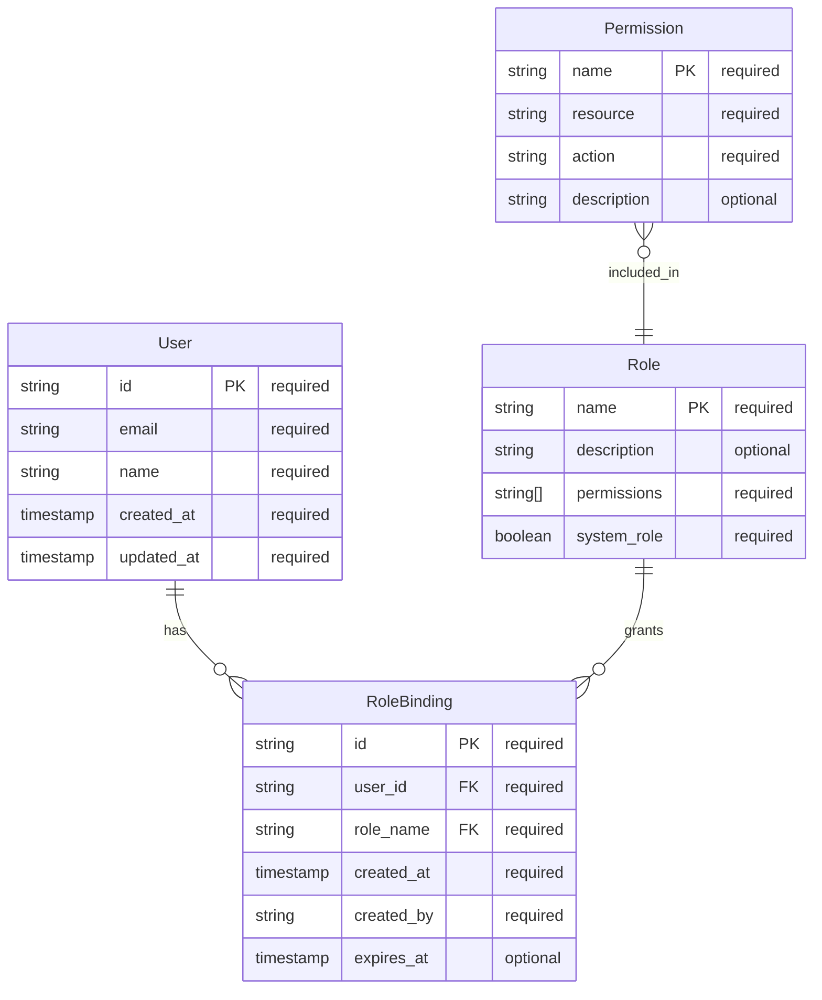

# Boss Plan Command

**Command:** `/boss.plan <spec-description>`  
**Purpose:** Create a factory plan from a specification, orchestrating pre-defined agents through dependency stages  
**Agent:** Boss (Human coordination agent)

## Usage

```bash
/boss.plan "Add RBAC: RoleBindings to users, constant values Roles and Permissions"
```

## Command Flow

1. **Parse Specification** → Extract entities, relationships, behaviors
2. **Generate ERD** → Create Mermaid entity relationship diagram  
3. **Create Factory Plan** → Map ERD to 9-stage agent pipeline
4. **Write Expectations** → Define acceptance criteria as executable tests
5. **Initialize Workspace** → Set up worktrees and agent assignments
6. **Begin Execution** → Start spec-review stage with Reviewer agent

## Implementation

### 1. Specification Parsing

```yaml
# Parsed from: "Add RBAC: RoleBindings to users, constant values Roles and Permissions"
spec:
  domain: "rbac"
  entities:
    - User (existing entity)
    - Role (constant values)
    - Permission (constant values) 
    - RoleBinding (new entity)
  relationships:
    - User ||--o{ RoleBinding : "has"
    - Role ||--o{ RoleBinding : "grants"
    - Permission }o--|| Role : "included_in"
  behaviors:
    - "Users can be assigned multiple roles via RoleBindings"
    - "Roles contain predefined permissions (read, write, admin)"
    - "RoleBindings enforce access control at API level"
```

### 2. ERD Generation



### 3. Factory Plan Creation

```json
{
  "factory": {
    "spec_name": "RBAC System",
    "spec_hash": "sha256:rbac_rolebindings_v1",
    "autonomy_level": 2,
    "created_at": "2026-03-05T...",
    
    "stages": [
      {
        "id": 1,
        "name": "spec-review",
        "agent": "Reviewer",
        "depends_on": [],
        "status": "pending",
        "gates": ["spec-approved", "erd-validated"],
        "timeout": "1h",
        "artifacts": {
          "input": ["spec.md", "erd.mermaid"],
          "output": ["spec-approval.md", "requirements.md"]
        }
      },
      {
        "id": 2, 
        "name": "trex-foundation",
        "agent": "TRex",
        "depends_on": [1],
        "status": "pending",
        "gates": ["boilerplate-generated", "migrations-ready"],
        "timeout": "30m",
        "artifacts": {
          "input": ["erd.mermaid"],
          "output": ["api-boilerplate/", "sdk-boilerplate/", "cli-boilerplate/", "console-boilerplate/"]
        }
      },
      {
        "id": 3,
        "name": "api-implementation",
        "agent": "API", 
        "depends_on": [2],
        "status": "pending",
        "gates": ["rbac-middleware-implemented", "endpoints-tested", "openapi-valid"],
        "timeout": "4h",
        "artifacts": {
          "input": ["api-boilerplate/"],
          "output": ["openapi.yml", "rbac-middleware/", "api-tests/"]
        }
      },
      {
        "id": 4,
        "name": "sdk-generation",
        "agent": "SDK",
        "depends_on": [3],
        "parallel_with": [5],
        "status": "pending", 
        "gates": ["clients-generated", "rbac-helpers-added"],
        "timeout": "2h",
        "artifacts": {
          "input": ["openapi.yml"],
          "output": ["go-sdk/", "python-sdk/", "typescript-sdk/"]
        }
      },
      {
        "id": 5,
        "name": "cli-generation", 
        "agent": "CLI",
        "depends_on": [3],
        "parallel_with": [4],
        "status": "pending",
        "gates": ["rbac-commands-added", "cli-auth-working"],
        "timeout": "2h", 
        "artifacts": {
          "input": ["openapi.yml"],
          "output": ["cli-commands/", "rbac-cli/"]
        }
      },
      {
        "id": 6,
        "name": "control-plane-behaviors",
        "agent": "CP",
        "depends_on": [3],
        "parallel_with": [7],
        "status": "pending",
        "gates": ["rbac-enforcement-working", "audit-logging-enabled"],
        "timeout": "3h",
        "artifacts": {
          "input": ["openapi.yml"],
          "output": ["rbac-controller/", "audit-service/"]
        }
      },
      {
        "id": 7,
        "name": "frontend-implementation",
        "agent": "Frontend", 
        "depends_on": [4],
        "parallel_with": [6],
        "status": "pending",
        "gates": ["rbac-ui-implemented", "role-management-working"],
        "timeout": "3h",
        "artifacts": {
          "input": ["typescript-sdk/"],
          "output": ["rbac-components/", "user-management-ui/"]
        }
      },
      {
        "id": 8,
        "name": "integration-review",
        "agent": "Reviewer",
        "depends_on": [6, 7],
        "status": "pending", 
        "gates": ["end-to-end-rbac-tested", "security-review-passed"],
        "timeout": "1h",
        "artifacts": {
          "input": ["all-components/"],
          "output": ["integration-report.md", "security-assessment.md"]
        }
      },
      {
        "id": 9,
        "name": "deployment",
        "agent": "Cluster",
        "depends_on": [8],
        "status": "pending",
        "gates": ["rbac-deployed", "e2e-tests-passed"],
        "timeout": "1h", 
        "artifacts": {
          "input": ["all-components/"],
          "output": ["deployment-manifests/", "e2e-test-results/"]
        }
      }
    ]
  }
}
```

### 4. Expectations (Test Specifications)

```yaml
# expectations/rbac-system.yaml
apiVersion: test.agent-boss.io/v1
kind: ExpectationSuite
metadata:
  name: rbac-system
  description: "RBAC RoleBindings acceptance criteria"
spec:
  expectations:
    
    # Data Model Expectations  
    - name: "role-binding-crud"
      description: "RoleBinding entity supports full CRUD operations"
      type: "api-test"
      agent: "API"
      test: |
        # Create RoleBinding
        POST /api/v1/role-bindings
        {
          "user_id": "user-123",
          "role_name": "editor", 
          "created_by": "admin-456"
        }
        expect: status=201, id field present
        
        # Read RoleBinding
        GET /api/v1/role-bindings/{id}
        expect: user_id="user-123", role_name="editor"
        
        # Update RoleBinding (add expiration)
        PATCH /api/v1/role-bindings/{id}
        {"expires_at": "2026-12-31T23:59:59Z"}
        expect: status=200, expires_at field updated
        
        # Delete RoleBinding
        DELETE /api/v1/role-bindings/{id}
        expect: status=204
        
        # Verify deletion
        GET /api/v1/role-bindings/{id}
        expect: status=404

    - name: "role-permissions-immutable" 
      description: "Roles have constant permission sets"
      type: "data-test"
      agent: "API"
      test: |
        # Verify predefined roles exist
        GET /api/v1/roles
        expect: contains roles=[admin, editor, viewer]
        
        # Verify admin permissions
        GET /api/v1/roles/admin
        expect: permissions=["read", "write", "delete", "manage_users", "manage_roles"]
        
        # Verify editor permissions  
        GET /api/v1/roles/editor
        expect: permissions=["read", "write"]
        
        # Verify viewer permissions
        GET /api/v1/roles/viewer  
        expect: permissions=["read"]
        
        # Attempt to modify system role (should fail)
        PATCH /api/v1/roles/admin
        {"permissions": ["read"]}
        expect: status=403, error="system roles immutable"

    # Authorization Expectations
    - name: "rbac-enforcement"
      description: "API enforces RBAC based on user role bindings"
      type: "auth-test" 
      agent: "CP"
      test: |
        # Setup: Create test user with editor role
        POST /api/v1/users {"id": "test-editor", "email": "editor@test.com"}
        POST /api/v1/role-bindings {"user_id": "test-editor", "role_name": "editor"}
        
        # Test editor can read
        GET /api/v1/resources (as test-editor)
        expect: status=200
        
        # Test editor can write  
        POST /api/v1/resources {"name": "test"} (as test-editor)
        expect: status=201
        
        # Test editor cannot delete (lacks permission)
        DELETE /api/v1/resources/123 (as test-editor) 
        expect: status=403, error="insufficient permissions"
        
        # Test editor cannot manage users
        POST /api/v1/users {"id": "new-user"} (as test-editor)
        expect: status=403, error="manage_users permission required"

    - name: "role-binding-expiration"
      description: "Expired role bindings are not honored"
      type: "time-test"
      agent: "CP"
      test: |
        # Create role binding with past expiration
        POST /api/v1/role-bindings 
        {
          "user_id": "temp-user",
          "role_name": "editor",
          "expires_at": "2026-01-01T00:00:00Z"
        }
        
        # Attempt to use expired binding
        GET /api/v1/resources (as temp-user)
        expect: status=403, error="role binding expired"

    # UI/CLI Expectations
    - name: "role-management-ui"
      description: "Frontend provides role binding management"
      type: "ui-test"
      agent: "Frontend"
      test: |
        # Navigate to user management
        visit: /admin/users
        expect: page contains "User Management"
        
        # View user roles
        click: user "test-user"
        expect: page shows current role bindings
        
        # Add new role
        click: "Add Role"
        select: role="editor"
        click: "Save"
        expect: success message, role appears in list
        
        # Remove role
        click: "Remove" (on editor role)
        confirm: removal dialog
        expect: role removed from list

    - name: "rbac-cli-commands"
      description: "CLI supports role binding operations"
      type: "cli-test" 
      agent: "CLI"
      test: |
        # List role bindings
        run: ambient rbac list-bindings --user=test-user
        expect: output contains role bindings for user
        
        # Add role binding
        run: ambient rbac bind --user=test-user --role=editor
        expect: exit_code=0, "role bound successfully"
        
        # Remove role binding
        run: ambient rbac unbind --user=test-user --role=editor
        expect: exit_code=0, "role binding removed"
        
        # Check user permissions
        run: ambient rbac check --user=test-user --permission=write
        expect: output="ALLOWED" or "DENIED" based on bindings

    # Performance & Scale Expectations
    - name: "rbac-performance"
      description: "RBAC enforcement scales to 10k users" 
      type: "load-test"
      agent: "Cluster"
      test: |
        # Setup: 10k users with role bindings
        setup: generate_test_users(10000, roles=["viewer", "editor"])
        
        # Test: Concurrent authorization checks
        load_test: 
          concurrent_users: 1000
          requests_per_user: 100
          endpoint: GET /api/v1/resources
          duration: 5m
        
        expect: 
          p95_latency < 200ms
          error_rate < 1%
          all_requests_properly_authorized

    # Security Expectations  
    - name: "privilege-escalation-prevention"
      description: "Users cannot escalate their own privileges"
      type: "security-test"
      agent: "Reviewer"
      test: |
        # User attempts to create role binding for themselves
        POST /api/v1/role-bindings (as editor-user)
        {
          "user_id": "editor-user", 
          "role_name": "admin"
        }
        expect: status=403, error="cannot modify own permissions"
        
        # User attempts to modify role permissions
        PATCH /api/v1/roles/editor (as editor-user)
        {"permissions": ["read", "write", "delete"]}
        expect: status=403, error="insufficient permissions"
```

### 5. Workspace Initialization

```bash
# Boss agent creates worktrees for each agent
mkdir -p workspaces/rbac-system/
cd workspaces/rbac-system/

# TRex worktree for boilerplate generation
git worktree add rbac-trex
cp factory-plan.json rbac-trex/
cp erd.mermaid rbac-trex/

# API worktree for implementation  
git worktree add rbac-api-server
cp expectations/rbac-system.yaml rbac-api-server/

# SDK worktree for multi-language clients
git worktree add rbac-sdk

# CLI worktree for command implementation
git worktree add rbac-cli

# CP worktree for enforcement logic
git worktree add rbac-control-plane

# Frontend worktree for UI components
git worktree add rbac-frontend

# Cluster worktree for deployment
git worktree add rbac-cluster
```

### 6. Agent Coordination

```markdown
# Boss posts to blackboard after plan creation:

### Boss
Factory plan **rbac-system** created with 9 stages, 8 agents coordinated.

**Current Stage:** spec-review (Reviewer)
**Timeline:** 1h spec review → 30m TRex → 4h API → 2h parallel (SDK+CLI) → 3h parallel (CP+Frontend) → 1h review → 1h deploy
**Total Estimate:** 12.5 hours

**Quality Gates Enforced:**
- TRex: boilerplate-generated, migrations-ready  
- API: rbac-middleware-implemented, endpoints-tested, openapi-valid
- SDK/CLI: clients-generated, rbac-helpers-added, cli-auth-working
- CP/Frontend: rbac-enforcement-working, rbac-ui-implemented
- Review: end-to-end-rbac-tested, security-review-passed
- Cluster: rbac-deployed, e2e-tests-passed

**Expectations Defined:** 8 test suites covering CRUD, authorization, UI, CLI, performance, security

@Reviewer: Please begin spec-review stage. ERD and expectations are ready in your worktree.
```

## Output Files Created

1. **`factory-plan.json`** - Complete 9-stage execution plan
2. **`erd.mermaid`** - Entity relationship diagram  
3. **`expectations/rbac-system.yaml`** - Acceptance test specifications
4. **`spec.md`** - Parsed specification document
5. **Worktree structure** - Isolated workspaces per agent
6. **Blackboard post** - Initial coordination message

## Integration with Agent Definitions

Each agent receives role-specific context from their `.claude/agents/*.yaml` definition:

- **Reviewer** → validates spec completeness, security implications
- **TRex** → generates RBAC boilerplate from ERD 
- **API** → implements middleware, authorization endpoints
- **SDK** → creates RBAC helper functions in all languages
- **CLI** → adds role management commands
- **CP** → implements enforcement and audit logging  
- **Frontend** → builds user/role management UI
- **Cluster** → deploys with RBAC manifests

The `/boss.plan` command transforms a natural language specification into a complete factory execution plan with pre-defined agents, quality gates, and measurable acceptance criteria.