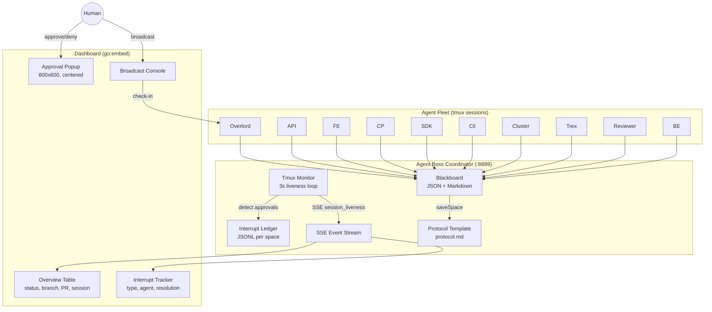
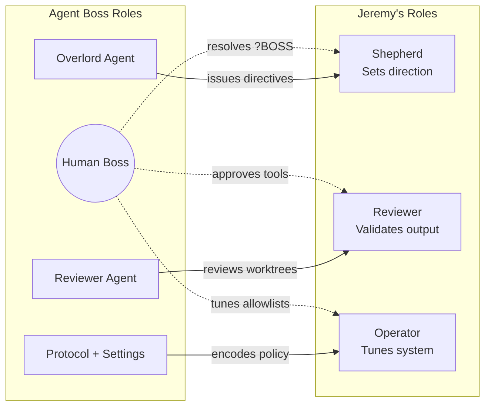
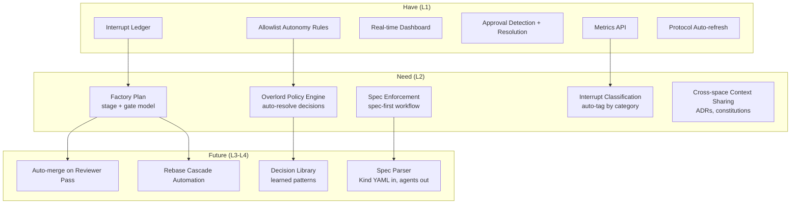
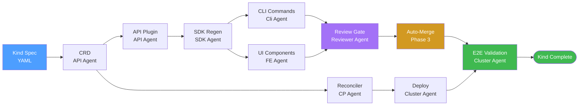
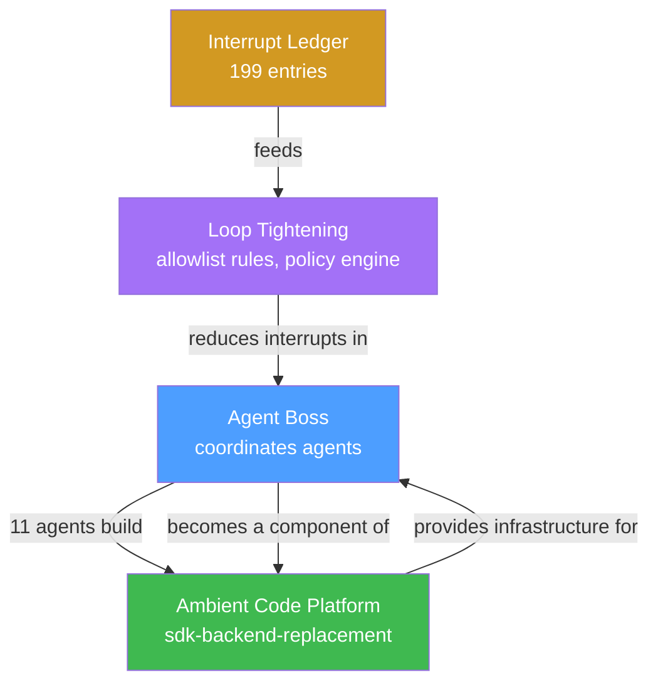
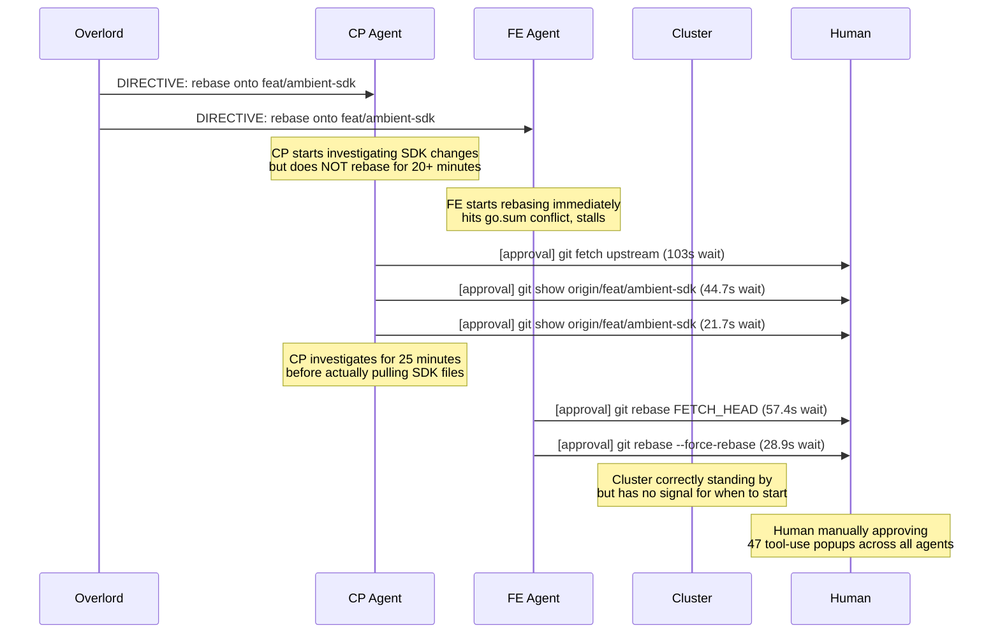

# Agent Boss: Operational Proof of Agentic Development at Scale

**Author:** Mike Turanski | **Date:** 2026-03-01 | **Status:** Proposal  
**Audience:** Jeremy Eder, AI Engineering Leadership  
**Distribution:** Internal — Red Hat AI Engineering  
**Revision:** v4 (v3 + updated interrupt metrics to 268 entries reflecting deployment phase)

---

## TL;DR

While building Ambient's `sdk-backend-replacement` with 11 concurrent agents, we built Agent Boss — a coordination system that implements the interrupt tracking, loop tightening, and role-based agent teaming described in Jeremy's *Agentic Development at Red Hat AI Engineering*. This proposal shows what we've proven, what's missing, and how Agent Boss becomes a component of Ambient itself.

---

## 1. What We Built (and What It Proves)

Agent Boss is a Go server (zero dependencies, stdlib only) that manages multi-agent coordination through a shared blackboard, real-time dashboard, and structured interrupt ledger.

### Live Data from `sdk-backend-replacement` (2026-03-01)

| Metric | Value |
|--------|-------|
| Agents | 11 (Overlord, API, BE, FE, CP, SDK, Cli, Cluster, Trex, Reviewer, Helper) |
| Total interrupts recorded | 268 |
| Human-resolved | 73/268 total (27%), 73/130 resolved (56%) |
| Auto-resolved | 57/268 total (21%), 57/130 resolved (44%) |
| Pending (unresolved at time of measurement) | 138 (51%) |
| Total human wait time | 35.9 minutes |
| Median wait per interrupt | 12.0 seconds |
| Max wait | 476.5 seconds |

### Architecture



---

## 2. Mapping to Jeremy's Five Lessons

### Lesson 1: Agents at Every SDLC Phase

| Paper Recommendation | Agent Boss Implementation | Status |
|---------------------|--------------------------|--------|
| Agents compress phase transitions | Blackboard carries context across agents and phases | Done |
| Specs flow into tests, tests into code | Reviewer agent reviews by worktree; test_count tracked per agent | Partial |
| Spec-driven development as forcing function | Protocol template enforces communication structure | Partial |

**Critical Gap:** We don't do SDD yet. Jeremy calls this "the single most important practice" — the one that makes review tractable and output reproducible. Our Overlord issues operational commands ("rebase and verify tests"), not specifications. Protocol.md is a *communication* spec, not a *feature* spec. Agents start work without a reviewed specification defining behavior, interfaces, or acceptance criteria. This is the gap that matters most.

### Lesson 2: Human + Agent Team Structure

Jeremy's model maps directly to our fleet:



**Worktree isolation** is stronger than Jeremy's model — each agent is physically scoped to its git worktree, enforcing the "agents cannot refactor unrelated modules" constraint at the filesystem level.

### Lesson 3: Control Through SDD + TDD

Our control mechanism is different but aligned: **channel enforcement + protocol + blackboard** instead of specs + tests.

| Jeremy's Control | Our Implementation |
|-----------------|-------------------|
| Spec bounds agent scope | Worktree scopes agent's filesystem |
| Spec makes review tractable | Structured JSON updates make status parseable |
| Tests verify against spec | `test_count` tracked; Reviewer validates by worktree |
| X-Agent-Name header (403 on cross-channel) | Prevents agents from posting to wrong channels |
| Failure escalation and rollback | **Not implemented** — no automatic escalation on gate failure or E2E break |

### Lesson 4: Audit and Trace (Our Strongest Alignment)

Jeremy writes: *"Interrupts are the most valuable signal"* and *"Claude doesn't offer great metrics. We have to implement them with hooks."*

We implemented exactly this:

| Jeremy's Metric | Our Implementation | Live Value |
|----------------|-------------------|------------|
| Interrupt rate per task | JSONL ledger + `/factory/metrics` | 268 in one session |
| Autonomous completion rate | `auto_resolved` / resolved | 44% (57/130 resolved without human) |
| Mean time to resolution | `wait_seconds` on every entry | 31.4s avg, 12.0s median |
| Interrupt recurrence rate | Pattern analysis identified 3 repeating categories | 93% reducible |
| Context coverage score | Allowlist rules deployed to settings.json | 47 rules active |

**Loop tightening in action:** We analyzed the interrupt data, identified that boss check-ins (25), git read-only (20), and blackboard reads (8) dominated the interrupts, and deployed a structural fix (allowlist in `~/.claude/settings.json`) that eliminates ~93% of approval interrupts. This is exactly Jeremy's feedback loop: interrupt → root cause → structural fix → fewer interrupts.

### Lesson 5: Scaling

| Paper Recommendation | Agent Boss | Status |
|---------------------|-----------|--------|
| Standardize control loop | Protocol template auto-refreshes on every agent POST | Done |
| Share context packages | Protocol is space-scoped; no cross-space sharing yet | Gap |
| Centralize observability | Dashboard with SSE, interrupt tracker, per-agent metrics | Done |
| Invest in platform, not agents | Zero external deps, go:embed, runs anywhere | Done |

---

## 3. What's Missing



### Critical Gaps (mapped to Jeremy's paper)

1. **Spec-Driven Development enforcement (Critical).** Jeremy calls this "the single most important practice we adopted. Without it, agents produce plausible but wrong code at scale." We don't do it. The Overlord issues operational directives ("rebase feat/ambient-control-plane"), not specifications. Agents produce working code, but there's no spec artifact to review against. This is the single highest-priority gap.

2. **Failure modes and rollback.** What happens when the factory plan produces a bad stage graph? When auto-merge breaks E2E? When the decision library makes a wrong call? Jeremy's paper emphasizes guardrails. We have none. The system works when agents are healthy, but there's no self-healing or automatic escalation.

3. **Decision Library.** Jeremy's "loop tightening" meeting reviews top interrupt categories weekly. We have the data (JSONL ledger) but no automated pattern matching. Recurring decisions like "rebase vs fresh branch" should auto-resolve after the first human decision.

4. **Cross-space context packages.** Jeremy wants ADRs, constitutions, and skill definitions versioned and shared. Our protocol.md is per-space. Lessons from `sdk-backend-replacement` don't automatically flow to `local-reconciler` or future spaces.

---

## 4. The Plan: Agent Boss as Ambient's Factory Controller

Ambient's component dependency tree is a natural factory pipeline. Agent Boss should become the system that accepts a Kind spec and produces deployed code — the exact "dark factory" pattern Jeremy envisions.

### Ambient Component Pipeline



Every new Ambient Kind (Workflow, Task, Skill, Agent, WorkflowTask) follows this exact cascade. Agent Boss already coordinates it manually. The factory plan formalizes it.

### Implementation: 4 Phases

#### Phase 1a: Spec-First Workflow (weeks 1-2)

This is the highest-priority gap. Before agents write code, they must work against a reviewed specification.

**Prerequisite:** The current `sdk-backend-replacement` pipeline must reach a stable merged state before factory plan development begins. Alternatively, Phase 1a can be validated against a new, smaller Kind (e.g., Skill or WorkflowTask) as the pilot — avoiding entanglement with in-flight manual orchestration.

**Kind Spec Format (skeleton):**

```yaml
apiVersion: ambient-code.io/v1alpha1
kind: KindSpec
metadata:
  name: Workflow
  space: sdk-backend-replacement
spec:
  behavior:
    description: "Orchestrates multi-step agent task execution"
    lifecycle: [pending, running, paused, completed, failed]
    transitions:
      - from: pending
        to: running
        trigger: "user starts workflow"
      - from: running
        to: completed
        trigger: "all tasks complete"
  interfaces:
    api_endpoints:
      - "POST /api/ambient/v1/projects/{project}/workflows"
      - "GET /api/ambient/v1/projects/{project}/workflows/{id}"
      - "PATCH /api/ambient/v1/projects/{project}/workflows/{id}"
      - "DELETE /api/ambient/v1/projects/{project}/workflows/{id}"
      - "GET /api/ambient/v1/projects/{project}/workflows"
    crd_fields:
      - name: tasks
        type: "[]TaskRef"
        description: "Ordered list of task references"
      - name: concurrency
        type: int
        default: 1
  constraints:
    - "Workflows belong to a Project (project_id required)"
    - "Deleting a running workflow cancels all in-flight tasks"
    - "concurrency=0 means unlimited parallelism"
  acceptance_criteria:
    - "CRUD endpoints return correct status codes"
    - "SDK regenerated with Workflow resource (Go, TypeScript, Python)"
    - "CLI `ambient workflow list/create/delete` functional"
    - "Operator reconciles Workflow CR to spawned TaskJobs"
    - "E2E: create workflow with 2 tasks, verify both execute"
```

- `POST /spaces/{space}/factory` accepts a Kind spec
- Coordinator decomposes spec into staged work orders matching the Ambient pipeline
- Overlord reads spec-derived stage graph instead of issuing ad-hoc directives
- Each agent's POST includes `"factory": {"stage": N, "gate": "pass|fail|pending"}`
- Agents cannot begin implementation without a spec in `gate: reviewed` state
- Liveness-based reassignment: if an agent goes offline for > N minutes, coordinator flags for human reassignment

#### Phase 1b: Dashboard Pipeline View (weeks 3-4)

Separate deliverable from spec integration — the DAG rendering is independent.

- Dashboard renders the stage dependency graph (replacing the flat overview table)
- Stage gate status visible per agent (pass/fail/pending)
- Interrupt classification: auto-tag `decision`, `approval`, `sequencing`, `review` from context
- Aggregate metrics always visible: interrupt count, idle time, elapsed time per stage

#### Phase 2: Autonomous Overlord (weeks 5-6)

Give the Overlord a decision policy engine derived from accumulated interrupt data.

- Parse JSONL interrupt history into a decision library
- Overlord consults library before escalating to `[?BOSS]`
- Auto-resolve sequencing interrupts from the stage DAG (no human needed to say "go")
- Auto-resolve known decision patterns (e.g., "stale PR > 7 days + > 20 upstream commits → fresh branch")
- **Rollback and escalation**: wrong auto-decisions are flagged within one stage boundary; coordinator reverts to human escalation and records the override to prevent recurrence

#### Phase 3: Merge Cascade (weeks 7-8)

Automate the rebase-and-merge pipeline that currently requires human orchestration.

- When Reviewer gate passes → auto-merge PR
- When upstream PR merges → coordinator triggers downstream rebase
- Retry budget: N attempts before escalating
- Cluster agent validates E2E; rollback on failure
- **Circuit breaker**: if E2E fails twice after auto-merge, halt the cascade and escalate to human

### Autonomy Progression

```mermaid
graph LR
    L0["L0: Manual<br/>(Feb 2026)"] -->|"+ interrupt ledger<br/>+ metrics API"| L1["L1: Measured<br/>(Done)"]
    L1 -->|"+ spec workflow<br/>+ stage gates<br/>+ allowlists"| L2["L2: Supervised<br/>(Phase 1a-1b)"]
    L2 -->|"+ policy engine<br/>+ decision library"| L3["L3: Approved<br/>(Phase 2-3)"]
    L3 -->|"+ spec parser<br/>+ zero routine interrupts"| L4["L4: Near-Dark Factory"]

    style L0 fill:#5c6578,color:#fff
    style L1 fill:#3fb950,color:#fff
    style L2 fill:#4d9eff,color:#fff
    style L3 fill:#a371f7,color:#fff
    style L4 fill:#d29922,color:#fff
```



| Level | Human Interrupts/Kind | Status |
|-------|----------------------|--------|
| L0 | ~20+ (unmeasured) | Was here Feb 2026 |
| L1 | Measured (47 human in current run) | **Current** |
| L2 | < 5 | Target: Phase 1a-1b |
| L3 | < 1 | Target: Phase 2-3 |
| L4 | 0 routine (novel decisions still escalate) | Future |

L4 is "zero *routine* interrupts" — not zero total. Every new Kind introduces at least one novel architectural constraint. The goal is eliminating recurring patterns, not eliminating human judgment on genuinely new decisions.

---

## 5. The Self-Improvement Loop

Here's the key insight: **Agent Boss is being built to improve Ambient, and Ambient is the platform that will host Agent Boss.**



Concretely:
1. Agent Boss coordinates 11 agents building Ambient's SDK backend replacement
2. The interrupt data from that work feeds back into Agent Boss's factory rules
3. Agent Boss itself runs on Ambient's infrastructure (Kubernetes, ROSA cluster already deployed)
4. Each new Ambient Kind processed through Agent Boss makes the next Kind faster
5. Agent Boss becomes a first-class Ambient component — the factory controller that ACP exposes to all teams

This is Jeremy's compounding advantage made literal: the tool improves the platform, and the platform improves the tool.

As an Ambient component, Agent Boss would expose a `FactoryPlan` CRD. The Ambient operator would reconcile FactoryPlans by coordinating agent sessions according to the stage DAG — following the existing CRD-driven pattern used for AgenticSessions (User Creates Session -> Backend Creates CR -> Operator Spawns Job). The coordinator server becomes the reconciler, the blackboard becomes the CR status, and interrupt metrics flow into Ambient's observability pipeline.

---

## 6. Alignment Summary

| Jeremy's Paper | Agent Boss | Evidence |
|---------------|-----------|---------|
| "Interrupts are the most valuable signal" | JSONL ledger, `/factory/metrics`, dashboard tracker | 268 entries, 35.9 min human wait measured |
| "Loop tightening" | Analyzed data → allowlist rules → 93% reduction | settings.json with 47 rules |
| "Agents as team roles, not personal assistants" | 11 role-defined agents with worktree isolation | Overlord, Reviewer, API, FE, CP, SDK, etc. |
| "Spec-driven development" | Protocol template (communication spec) | **Critical Gap: no feature spec enforcement** |
| "Context engineering > model capability" | Protocol auto-refresh, structured JSON format | Agents carry context via blackboard |
| "Share context packages across teams" | Per-space protocol | **Gap: no cross-space sharing** |
| "Centralize observability" | Dashboard with SSE, real-time approval, interrupt tracker | Live at localhost:8899 |
| "Drive interrupt rate toward zero" | L0 → L1 achieved; L2 planned | 73 human → target < 5 |

---

## 7. What Went Wrong: A Real Coordination Failure

During the `sdk-backend-replacement` cascade on 2026-03-01, the SDK agent pushed fix `b5e67ac`. The Overlord issued a directive: CP rebase, then FE rebase, then Cluster redeploy. Here's what actually happened:



**What the factory plan would fix:**
- CP and FE both received "rebase" directives but had no sequencing — CP should have finished first (FE depends on CP's SDK changes)
- The Overlord had no stage gates to check — it couldn't tell that CP was investigating rather than rebasing
- Cluster had no trigger — it polled the blackboard waiting for a human to say "go"
- The human spent 55.2 minutes approving tool-use popups that were all safe read-only operations (now fixed by allowlists)

A factory plan with explicit `depends_on` relationships and gate signals would have prevented the parallel stall and eliminated the human as the sequencing bottleneck.

---

## 8. Failure Modes and Guardrails

Every automation level introduces new failure modes. The system must degrade gracefully.

| Failure | Detection | Response |
|---------|-----------|----------|
| Bad stage graph from spec | Agent reports `gate: fail` with mismatched dependencies | Coordinator flags spec for human review; agents halt |
| Auto-merge breaks E2E | Cluster agent reports E2E failure after merge | Circuit breaker: revert merge, halt cascade, escalate to human |
| Decision library wrong call | Downstream agent hits unexpected state | Override recorded; pattern confidence decremented; future matches escalate to human |
| Agent goes offline mid-stage | Tmux liveness detects no session for > 5 min | Coordinator marks agent `stale`; Overlord reassigns or human intervenes |
| Rebase cascade conflict | Agent reports merge conflict in gate | Retry once with `--force-rebase`; if conflict persists, escalate with diff context |
| Multiple agents stale simultaneously | Liveness loop detects > 3 agents offline | Emergency broadcast + human alert; do not auto-reassign (risk of cascading failures) |

The principle: **every automated action has a rollback path, and every rollback path ends at a human.**

---

## 9. Ask

1. **Review this proposal** for alignment with the agentic development paper and ACP roadmap.
2. **Designate a pilot Kind** (Workflow, Task, or Skill) to run through Agent Boss as the first formal L2 factory run with spec-first workflow.
3. **Integrate Agent Boss into ACP** as a platform component — the factory controller for multi-agent coordination, interrupt tracking, and autonomy progression.

The infrastructure exists. The data — 268 interrupts measured, 93% reducible by allowlist, 35.9 minutes of human wait time quantified — proves the pattern works. The question is whether we formalize it.
