# Software Factory: Component Dependency Tree

The platform follows a cascading dependency model. Changes at the top of the tree propagate downstream through code generation, module imports, and deployment artifacts.

## Dependency Graph

```
                    ┌──────────────┐
                    │   CRD YAML   │  manifests/base/crds/
                    │  (Kind def)  │
                    └──────┬───────┘
                           │
              ┌────────────┼────────────────┐
              │            │                │
              ▼            ▼                ▼
        ┌──────────┐ ┌──────────┐    ┌──────────┐
        │ Operator  │ │ Backend  │    │   API    │ (API Server)
        │(K8s CRDs)│ │(K8s CRDs)│    │(OpenAPI  │
        └──────────┘ └────┬─────┘    │ + GORM)  │
             │             │         └────┬─────┘
             │             │              │
             │             │        ┌─────┴──────┐
             │             │        │  SDK Gen   │ (make generate-sdk)
             │             │        │ parser.go  │ ← hardcoded resource map
             │             │        └─────┬──────┘
             │             │              │
             │             │    ┌─────────┼─────────┐
             │             │    ▼         ▼         ▼
             │             │ ┌──────┐ ┌──────┐ ┌──────┐
             │             │ │Go SDK│ │Py SDK│ │TS SDK│
             │             │ └──┬───┘ └──────┘ └──┬───┘
             │             │    │                  │
             │             │    ▼                  ▼
             │             │ ┌──────┐         ┌──────────┐
             │             │ │ CLI  │         │ Frontend  │
             │             │ │acpctl│         │(v1 hooks) │
             │             │ └──┬───┘         └────┬─────┘
             │             │    │                  │
             │             │    ▼                  │
             │             │ ┌────────────────┐    │
             │             │ │ Control Plane  │◄───┘
             │             │ │(SDK + K8s CRD) │    (indirect: CP syncs
             │             │ └────────────────┘     API server ↔ CRDs)
             │             │
             ▼             ▼
        ┌─────────────────────┐
        │      Cluster        │
        │  (deploy manifests) │
        └─────────────────────┘
```

## Two Parallel Data Planes

The platform has two paths for data flow, both converging on Kubernetes CRDs:

**CRD-native path (original):**
Frontend → Backend → K8s CRDs → Operator (reconciles Jobs/Pods)

**Database-backed path (new):**
SDK/CLI → API (PostgreSQL) → Control Plane → K8s CRDs

The Control Plane acts as a bidirectional sync bridge between the API server's relational models and Kubernetes CRDs.

## New Kind Cascade

When a new Kind is added, changes propagate through 8 ordered steps. Steps 2, 3, and 4 can run in parallel.

| Step | Component | What Changes | Depends On |
|------|-----------|-------------|------------|
| **1** | CRD YAML | New CRD file in `manifests/base/crds/`, add to `kustomization.yaml` | — |
| **2** | API (Server) | New plugin: `model.go` (GORM), `handler.go`, OpenAPI YAML, routes | Step 1 |
| **3** | Operator | New GVR in `types/resources.go`, new reconciler/handler | Step 1 |
| **4** | Backend | New GVR in `k8s/resources.go`, new types in `types/`, new handlers | Step 1 |
| **5** | SDK Generator | Update `parser.go` resource map, run `make generate-sdk` (Go/Py/TS) | Step 2 |
| **6** | CLI | New `acpctl` subcommands using SDK types/client | Step 5 |
| **7** | Frontend | New v1 hooks, adapter, UI components using TS SDK types | Step 5 |
| **8** | Control Plane | New informer cache, reconciler logic for Kind sync (API ↔ CRD) | Steps 3, 4, 5 |

### Parallelism Schedule

```
Time →
──────────────────────────────────────────
Step 1: CRD      ████
Step 2: API          ████████
Step 3: Operator     ████████             (parallel with 2, 4)
Step 4: Backend      ████████             (parallel with 2, 3)
Step 5: SDK Gen           ████            (waits for 2)
Step 6: CLI                 ████          (waits for 5)
Step 7: Frontend            ████          (waits for 5)
Step 8: CP                    ████████    (waits for 3, 4, 5)
Step 9: Cluster                   ████    (waits for all)
```

## Component Dependency Details

### Independent Components (no cross-project imports)

**Backend** — Self-contained Go module. Defines its own types in `types/`. Talks directly to K8s via `k8s.io/client-go`. No SDK or API server dependency.

**Operator** — Self-contained Go module. Uses `controller-runtime` and `k8s.io/client-go`. Watches CRDs via `unstructured.Unstructured`. No SDK or API server dependency.

### API Server → SDK Chain (code generation)

**API (Server)** — Owns the canonical OpenAPI spec (`openapi/*.yaml`). Defines database models via GORM (PostgreSQL). Never touches K8s CRDs directly.

**SDK Generator** — Custom Go generator (`generator/parser.go`) reads the OpenAPI spec from `../ambient-api-server/openapi/openapi.yaml` (filesystem-relative). Resource names are hardcoded in a map — new Kinds require editing `parser.go:40-45`. Outputs Go, Python, and TypeScript SDKs.

**Go SDK** — Generated. Consumed by CLI and Control Plane via `replace` directive (`=> ../ambient-sdk/go-sdk`).

**TypeScript SDK** — Generated. Consumed by Frontend as `@ambient-platform/sdk` via `file:../ambient-sdk/ts-sdk` in `package.json`.

**Python SDK** — Generated. Standalone, not currently consumed by other components.

### Downstream Consumers

**CLI (`acpctl`)** — Imports Go SDK types and client. Uses `replace` directive. The legacy `ambient` command tree bypasses the SDK and uses raw HTTP.

**Frontend** — Dual-mode: original K8s path (hand-rolled `apiClient` → Next.js routes → Backend) and new v1 path (`AmbientClient` from TS SDK → API server). A `v1SessionToAgenticSession()` adapter bridges the SDK's flat model to the K8s-shaped types the UI expects.

**Control Plane** — The only component with cross-project dependencies on both the SDK and the API server (via `replace` directives). Reconciles API server state ↔ K8s CRDs bidirectionally.

## Key Constraints

- All cross-project dependencies use Go `replace` directives — no published modules
- The SDK generator's resource map is hardcoded — it won't auto-discover new OpenAPI resources
- CRD types are defined independently in each component (no shared type library)
- Backend and Operator can always be worked in parallel with the API → SDK chain
- The Control Plane is the convergence point — it blocks on Operator, Backend, and SDK all being ready

## Local Workflow: Worktrees, Cherry-Picks, and Reviews

Each component gets its own git worktree, feature branch, and eventual PR. Downstream agents cherry-pick upstream commits to unblock their work. As upstream PRs merge to `main`, the cherry-picked commits fall out during rebase.

### Current Worktree Layout

| Worktree | Branch | Agent | Component |
|----------|--------|-------|-----------|
| `platform/` | `feat/frontend_to_api` | FE, Cluster, Overlord | Frontend, Manifests |
| `platform-api-server/` | `pr/multi-component-grpc-integration` | API | API Server |
| `platform-sdk/` | `feat/ambient-sdk` | SDK | SDK Generator + Go/Py/TS SDKs |
| `platform-cli/` | `feat/ambient-cli` | Cli | CLI (`acpctl`) |
| `platform-control-plane/` | `feat/ambient-control-plane` | CP, BE, Trex | Control Plane, Backend, Operator |
| `platform-reviewer/` | (detached) | Reviewer | Code review only |

All worktrees share the same git repository (`ambient-code/platform`). Cherry-picking across worktrees is a standard `git cherry-pick <sha>` since they share history.

### Cherry-Pick Dependency Map

For a new Kind, each downstream agent cherry-picks specific commits from upstream agents. The table shows what each agent needs and from whom.

| Agent | Own Branch | Cherry-Picks From | Specific Files Needed |
|-------|-----------|-------------------|----------------------|
| **API** | `feat/api-new-kind` | — (upstream, starts the chain) | — |
| **Operator** | `feat/operator-new-kind` | CRD commit (Step 1, if separate) | `manifests/base/crds/<new>-crd.yaml` |
| **Backend** | `feat/backend-new-kind` | CRD commit (Step 1, if separate) | `manifests/base/crds/<new>-crd.yaml` |
| **SDK** | `feat/sdk-new-kind` | API agent | `ambient-api-server/openapi/openapi.<new>.yaml`, `openapi.yaml` (root ref) |
| **CLI** | `feat/cli-new-kind` | SDK agent | `ambient-sdk/go-sdk/types/<new>.go`, `ambient-sdk/go-sdk/client/<new>.go` |
| **Frontend** | `feat/fe-new-kind` | SDK agent | `ambient-sdk/ts-sdk/src/<new>.ts`, `ambient-sdk/ts-sdk/src/index.ts` |
| **CP** | `feat/cp-new-kind` | SDK agent + API agent | Go SDK types + API server gRPC/types |

### How Cherry-Picks Flow and Fall Away

```
Time →  Upstream merges to main          Downstream rebases
────────────────────────────────────────────────────────────

1. API agent commits OpenAPI spec for new Kind
   │
   ├──► SDK agent cherry-picks API's OpenAPI commits
   │    SDK runs `make generate-sdk`, commits generated files
   │    │
   │    ├──► CLI agent cherry-picks SDK's generated Go files
   │    │    CLI adds new subcommands, commits
   │    │
   │    ├──► FE agent cherry-picks SDK's generated TS files
   │    │    FE adds hooks/components, commits
   │    │
   │    └──► CP agent cherry-picks SDK's Go files + API types
   │         CP adds reconciler, commits
   │
2. API PR merges to main ◄── Reviewer approves
   │
   ├──► SDK agent rebases onto main
   │    API's cherry-picked commits DISAPPEAR (already in main)
   │    SDK's own commits remain clean
   │    SDK PR is now reviewable
   │
3. SDK PR merges to main ◄── Reviewer approves
   │
   ├──► CLI rebases → SDK cherry-picks disappear
   ├──► FE rebases → SDK cherry-picks disappear
   └──► CP rebases → SDK cherry-picks disappear
        All downstream PRs are now clean
```

### Cherry-Pick Rules

**What to cherry-pick (clean, conflict-free):**
- OpenAPI spec files (`openapi/*.yaml`) — API → SDK
- Generated SDK files (`go-sdk/`, `python-sdk/`, `ts-sdk/`) — SDK → CLI, FE, CP
- CRD YAML files (`manifests/base/crds/`) — any → Operator, Backend

**What NOT to cherry-pick (conflict-prone shared files):**
- `manifests/` deployment configs (kustomization, deployments)
- `scripts/pre-commit/` wrappers
- `.github/workflows/` CI definitions
- Root-level files (`Makefile`, `.pre-commit-config.yaml`, `CLAUDE.md`)

These shared files should only be modified by one agent at a time, or deferred to a final integration commit.

### Reviewer Workflow

The Reviewer agent operates from a detached-HEAD worktree (`platform-reviewer/`) and participates at two checkpoints:

**Checkpoint 1 — Local review before GitHub PR:**

```
Agent finishes work → Posts to blackboard "ready for review"
  → Reviewer checks out agent's branch in its worktree
  → Reviewer runs: build, tests, lint
  → Reviewer reads diff, posts feedback to blackboard
  → Agent addresses feedback, posts "ready for re-review"
  → Reviewer approves → Agent pushes to origin, opens GitHub PR
```

**Checkpoint 2 — Post-merge rebase verification:**

```
Upstream PR merges to main
  → Downstream agent rebases onto main
  → Cherry-picked commits fall away
  → Reviewer verifies: clean diff, tests pass, no orphaned cherry-picks
  → Downstream agent's PR is now GitHub-ready
```

### Agent Commands Reference

Each agent uses these git operations in their worktree:

```bash
# Upstream agent: tag commits for downstream consumption
git log --oneline feat/api-new-kind ^main  # show commits to cherry-pick

# Downstream agent: cherry-pick upstream work
git cherry-pick <sha1> <sha2>              # grab specific commits
git cherry-pick <sha1>..<sha3>             # grab a range

# After upstream merges: rebase to shed cherry-picks
git fetch origin main
git rebase origin/main                     # cherry-picked commits vanish

# Reviewer: check any agent's branch
git checkout feat/sdk-new-kind             # switch to agent's branch
go test ./...                              # verify
git checkout --detach                      # return to detached state
```

### Conflict Zones and Mitigations

| Shared Path | Who Touches It | Mitigation |
|-------------|---------------|------------|
| `manifests/base/crds/` | CRD author (Step 1) | Cherry-pick to Operator + Backend only; clean file-add, no conflicts |
| `manifests/base/kustomization.yaml` | CRD author | Single line addition; cherry-pick or defer to integration |
| `manifests/overlays/` | Cluster agent | Cluster agent owns this exclusively; no cherry-pick needed |
| `ambient-sdk/generator/parser.go` | SDK agent | SDK agent owns the resource map; no cherry-pick needed |
| `frontend/package.json` | FE agent | FE agent owns; TS SDK is already a `file:` dependency |

### Merge Order to Main

PRs merge in dependency order. Each merge unblocks the next rebase.

```
1. CRD YAML          ──► merge first (if separate PR)
2. API Server         ──► merge second
3. Operator           ──► merge third  (parallel with 4)
4. Backend            ──► merge fourth (parallel with 3)
5. SDK                ──► merge fifth  (after 2)
6. CLI                ──► merge sixth  (after 5, parallel with 7)
7. Frontend           ──► merge seventh (after 5, parallel with 6)
8. Control Plane      ──► merge last   (after 3, 4, 5)
```

Each merge triggers downstream agents to rebase, shedding cherry-picks. The Reviewer verifies each rebase before the downstream PR goes to GitHub.

## Automated Pipeline: Agent Orchestration

The factory pipeline is event-driven. Each agent watches the blackboard for upstream completion signals, performs its work, passes through a Reviewer quality gate, and then signals downstream agents to begin. Overlord orchestrates the flow but does not perform implementation work.

### Pipeline Diagram

```mermaid
flowchart TB
    %% ── Input ──
    Spec["📋 Kind Specification<br/><i>name, fields, validation,<br/>phases, relationships</i>"]

    %% ── Overlord ──
    Overlord{"🎯 Overlord<br/>Parse spec, create<br/>work orders, assign agents"}

    Spec --> Overlord

    %% ── Stage 1: CRD ──
    subgraph stage1 ["Stage 1: CRD Definition"]
        CRD_Work["API Agent<br/>writes CRD YAML +<br/>kustomization entry"]
        CRD_Gate{"🔍 Reviewer<br/>Gate 1"}
        CRD_Done(("✅ CRD<br/>approved"))

        CRD_Work --> CRD_Gate
        CRD_Gate -- "PASS" --> CRD_Done
        CRD_Gate -. "FAIL: feedback" .-> CRD_Work
    end

    Overlord --> CRD_Work

    %% ── Stage 2: Parallel Implementation ──
    subgraph stage2 ["Stage 2: Parallel Implementation"]
        direction TB

        subgraph lane_api ["API Lane"]
            API_Cherry["🍒 cherry-pick<br/>CRD commit"]
            API_Work["API Agent<br/>plugin + OpenAPI +<br/>GORM + routes + tests"]
            API_Gate{"🔍 Reviewer<br/>Gate 2a"}
            API_Done(("✅ API<br/>approved"))

            API_Cherry --> API_Work --> API_Gate
            API_Gate -- "PASS" --> API_Done
            API_Gate -. "FAIL" .-> API_Work
        end

        subgraph lane_op ["Operator Lane"]
            OP_Cherry["🍒 cherry-pick<br/>CRD commit"]
            OP_Work["Operator Agent<br/>GVR + reconciler +<br/>handler + tests"]
            OP_Gate{"🔍 Reviewer<br/>Gate 2b"}
            OP_Done(("✅ Operator<br/>approved"))

            OP_Cherry --> OP_Work --> OP_Gate
            OP_Gate -- "PASS" --> OP_Done
            OP_Gate -. "FAIL" .-> OP_Work
        end

        subgraph lane_be ["Backend Lane"]
            BE_Cherry["🍒 cherry-pick<br/>CRD commit"]
            BE_Work["Backend Agent<br/>GVR + types +<br/>handlers + tests"]
            BE_Gate{"🔍 Reviewer<br/>Gate 2c"}
            BE_Done(("✅ Backend<br/>approved"))

            BE_Cherry --> BE_Work --> BE_Gate
            BE_Gate -- "PASS" --> BE_Done
            BE_Gate -. "FAIL" .-> BE_Work
        end
    end

    CRD_Done --> API_Cherry
    CRD_Done --> OP_Cherry
    CRD_Done --> BE_Cherry

    %% ── Stage 3: SDK Generation ──
    subgraph stage3 ["Stage 3: SDK Generation"]
        SDK_Cherry["🍒 cherry-pick<br/>API OpenAPI commits"]
        SDK_Work["SDK Agent<br/>parser.go map +<br/>make generate-sdk +<br/>Go/Py/TS tests"]
        SDK_Gate{"🔍 Reviewer<br/>Gate 3"}
        SDK_Done(("✅ SDK<br/>approved"))

        SDK_Cherry --> SDK_Work --> SDK_Gate
        SDK_Gate -- "PASS" --> SDK_Done
        SDK_Gate -. "FAIL" .-> SDK_Work
    end

    API_Done --> SDK_Cherry

    %% ── Stage 4: Parallel Consumers ──
    subgraph stage4 ["Stage 4: SDK Consumers"]
        direction TB

        subgraph lane_cli ["CLI Lane"]
            CLI_Cherry["🍒 cherry-pick<br/>Go SDK commits"]
            CLI_Work["CLI Agent<br/>acpctl subcommands +<br/>table rendering + tests"]
            CLI_Gate{"🔍 Reviewer<br/>Gate 4a"}
            CLI_Done(("✅ CLI<br/>approved"))

            CLI_Cherry --> CLI_Work --> CLI_Gate
            CLI_Gate -- "PASS" --> CLI_Done
            CLI_Gate -. "FAIL" .-> CLI_Work
        end

        subgraph lane_fe ["Frontend Lane"]
            FE_Cherry["🍒 cherry-pick<br/>TS SDK commits"]
            FE_Work["FE Agent<br/>v1 hooks + adapter +<br/>UI components + build"]
            FE_Gate{"🔍 Reviewer<br/>Gate 4b"}
            FE_Done(("✅ FE<br/>approved"))

            FE_Cherry --> FE_Work --> FE_Gate
            FE_Gate -- "PASS" --> FE_Done
            FE_Gate -. "FAIL" .-> FE_Work
        end
    end

    SDK_Done --> CLI_Cherry
    SDK_Done --> FE_Cherry

    %% ── Stage 5: Control Plane ──
    subgraph stage5 ["Stage 5: Control Plane Integration"]
        CP_Cherry["🍒 cherry-pick<br/>Go SDK + API types"]
        CP_Work["CP Agent<br/>informer + reconciler +<br/>bidirectional sync + tests"]
        CP_Gate{"🔍 Reviewer<br/>Gate 5"}
        CP_Done(("✅ CP<br/>approved"))

        CP_Cherry --> CP_Work --> CP_Gate
        CP_Gate -- "PASS" --> CP_Done
        CP_Gate -. "FAIL" .-> CP_Work
    end

    SDK_Done --> CP_Cherry
    OP_Done --> CP_Cherry
    BE_Done --> CP_Cherry

    %% ── Stage 6: Merge Cascade ──
    subgraph stage6 ["Stage 6: Merge Cascade"]
        Merge_API["Merge API PR → main"]
        Rebase_SDK["SDK rebases<br/>API cherry-picks fall away"]
        Merge_SDK["Merge SDK PR → main"]
        Merge_OpBe["Merge Operator +<br/>Backend PRs → main"]
        Rebase_Down["CLI + FE + CP rebase<br/>SDK cherry-picks fall away"]
        Merge_Rest["Merge CLI + FE +<br/>CP PRs → main"]

        Merge_API --> Rebase_SDK --> Merge_SDK --> Rebase_Down --> Merge_Rest
        Merge_OpBe --> Rebase_Down
    end

    API_Done --> Merge_API
    OP_Done --> Merge_OpBe
    BE_Done --> Merge_OpBe
    CP_Done --> Merge_Rest
    CLI_Done --> Merge_Rest
    FE_Done --> Merge_Rest

    %% ── Stage 7: Deploy ──
    subgraph stage7 ["Stage 7: Cluster Deployment"]
        Cluster_Work["Cluster Agent<br/>build images +<br/>deploy manifests +<br/>integration tests"]
        Cluster_Gate{"🔍 Reviewer<br/>Gate 7"}
        Ship(("🚀 Shipped"))

        Cluster_Work --> Cluster_Gate
        Cluster_Gate -- "PASS" --> Ship
        Cluster_Gate -. "FAIL" .-> Cluster_Work
    end

    Merge_Rest --> Cluster_Work
```



### Quality Gates

Every Reviewer gate runs the same structured checklist, scoped to the component under review.

| Gate | Component | Build Check | Test Check | Lint Check | Spec Conformance | Files Scope |
|------|-----------|-------------|------------|------------|------------------|-------------|
| **1** | CRD | `kubectl apply --dry-run=client` | CEL validation rules parse | `check-yaml` | Fields match Kind spec | `manifests/base/crds/` only |
| **2a** | API | `go build ./...` | `go test ./...` (all plugin tests) | `gofmt`, `go vet`, `golangci-lint` | OpenAPI matches CRD fields, GORM model matches OpenAPI | `ambient-api-server/` only |
| **2b** | Operator | `go build ./...` | `go test -race ./...` | `gofmt`, `go vet`, `golangci-lint` | GVR matches CRD group/version/resource | `operator/` only |
| **2c** | Backend | `go build ./...` | `go test -race ./...` | `gofmt`, `go vet`, `golangci-lint` | Handler routes match Kind name, types match CRD spec | `backend/` only |
| **3** | SDK | `go build`, `npm run build`, `uv pip install` | Go/Py/TS test suites | `gofmt`, `ruff`, `eslint` | Generated types match OpenAPI, spec hash embedded | `ambient-sdk/` only |
| **4a** | CLI | `go build ./...` | `go test -race ./...` | `gofmt`, `go vet`, `golangci-lint` | Subcommand name matches Kind, flags match spec fields | `ambient-cli/` only |
| **4b** | Frontend | `npm run build` (0 errors, 0 warnings) | Component tests if present | `eslint` | Hooks use SDK types, adapter maps all fields | `frontend/` only |
| **5** | CP | `go build ./...` | `go test -race ./...` | `gofmt`, `go vet`, `golangci-lint` | Reconciler syncs all fields bidirectionally | `ambient-control-plane/` only |
| **7** | Cluster | All images build | E2E tests pass | — | New Kind CRUD works end-to-end | Full cluster |

### Blackboard Data Contract

Each agent posts structured status to the blackboard after every state transition. The Overlord and downstream agents consume these fields to make decisions.

#### Agent Status Post (required fields)

```json
{
  "status": "working|review-ready|approved|cherry-pickable|merged|blocked",
  "summary": "Agent: one-line description",
  "branch": "feat/api-new-kind",
  "pr": "#123",
  "test_count": 112,
  "phase": "stage-2a",

  "factory": {
    "kind_name": "Workflow",
    "stage": 2,
    "gate": "pending|pass|fail",
    "gate_failures": ["golangci-lint: unused variable line 42"],

    "upstream_cherry_picks": [
      {"from_agent": "API", "commit_sha": "abc1234", "files": ["openapi/openapi.workflows.yaml"]}
    ],

    "downstream_artifacts": [
      {"file": "openapi/openapi.workflows.yaml", "commit_sha": "abc1234", "type": "openapi-spec"},
      {"file": "openapi/openapi.yaml", "commit_sha": "abc1234", "type": "openapi-root"}
    ],

    "ready_for_cherry_pick": true
  }
}
```

#### Key Fields

| Field | Purpose | Who Reads It |
|-------|---------|--------------|
| `factory.kind_name` | Which Kind this work is for | Overlord (routing) |
| `factory.stage` | Current pipeline stage number | Overlord (sequencing) |
| `factory.gate` | Reviewer gate result | Downstream agents (go/no-go) |
| `factory.gate_failures` | Specific failure reasons | Owning agent (fix loop) |
| `factory.upstream_cherry_picks` | What was cherry-picked from whom | Reviewer (audit trail) |
| `factory.downstream_artifacts` | Commits available for downstream cherry-pick | Downstream agents (what to grab) |
| `factory.ready_for_cherry_pick` | Explicit signal that work is stable | Downstream agents (trigger) |

### Agent Triggers

Each agent watches the blackboard for specific conditions before starting work.

| Agent | Watches For | Trigger Condition | Action |
|-------|-------------|-------------------|--------|
| **API** | Overlord work order | `kind_name` assigned, `stage: 1, gate: pass` | Cherry-pick CRD, begin plugin implementation |
| **Operator** | Stage 1 completion | `CRD gate: pass` | Cherry-pick CRD, begin reconciler |
| **Backend** | Stage 1 completion | `CRD gate: pass` | Cherry-pick CRD, begin handlers |
| **SDK** | API gate pass | `API gate: pass, ready_for_cherry_pick: true` | Cherry-pick OpenAPI commits, run generator |
| **CLI** | SDK gate pass | `SDK gate: pass, ready_for_cherry_pick: true` | Cherry-pick Go SDK, add subcommands |
| **FE** | SDK gate pass | `SDK gate: pass, ready_for_cherry_pick: true` | Cherry-pick TS SDK, add hooks/UI |
| **CP** | SDK + Operator + Backend gates pass | All three `gate: pass` | Cherry-pick SDK + types, build reconciler |
| **Cluster** | All PRs merged | All agents `status: merged` | Build images, deploy, run E2E |
| **Reviewer** | Any agent `status: review-ready` | Agent requests review | Check out branch, run gate checks |
| **Overlord** | Any state change | Continuous | Update pipeline view, unblock stalls, escalate |

### Feedback Loops

When a Reviewer gate fails, the feedback loop is tight and structured:

```
Agent posts: status=review-ready
  → Reviewer checks out branch, runs gate checks
  → Gate FAILS
  → Reviewer posts to own channel:
      {gate: "fail", gate_failures: ["go vet: shadow variable in handler.go:45"]}
  → Agent reads Reviewer channel, sees failure
  → Agent fixes, re-commits, posts: status=review-ready (retry)
  → Reviewer re-runs gate
  → Gate PASSES
  → Reviewer posts: {gate: "pass"}
  → Downstream agents see ready_for_cherry_pick=true, begin work
```

No human intervention. The agent-Reviewer loop repeats until the gate passes or a configurable retry limit is hit (at which point Overlord escalates with `[?BOSS]`).

## Dark Factory Vision

The end state is a fully autonomous pipeline where the only human input is the Kind specification. No human reviews, no human merges, no human deploys.

### Kind Specification Format

The specification is the single input document that drives the entire factory. It contains everything every agent needs to generate its component.

```yaml
kind: AmbientKindSpec
metadata:
  name: Workflow
  group: vteam.ambient-code
  version: v1alpha1
  scope: Namespaced
  shortNames: [wf]

spec:
  fields:
    - name: name
      type: string
      required: true
      maxLength: 253
      pattern: "^[a-z0-9]([a-z0-9-]*[a-z0-9])?$"
    - name: description
      type: string
    - name: steps
      type: array
      items:
        type: object
        properties:
          - name: name
            type: string
            required: true
          - name: agentModel
            type: string
            default: "claude-sonnet-4-20250514"
          - name: prompt
            type: string
            required: true
          - name: timeout
            type: integer
            default: 3600
    - name: schedule
      type: string
      description: "Cron expression for recurring execution"
    - name: maxConcurrency
      type: integer
      default: 1
      minimum: 1
      maximum: 10

  status:
    phases:
      - Pending
      - Validating
      - Running
      - Paused
      - Completed
      - Failed
    fields:
      - name: currentStep
        type: integer
      - name: completedSteps
        type: integer
      - name: startTime
        type: dateTime
      - name: completionTime
        type: dateTime
      - name: lastRunId
        type: string

  relationships:
    - kind: Project
      type: belongs-to
      field: projectId
      required: true
    - kind: Session
      type: has-many
      description: "Each step spawns a Session"

  rbac:
    verbs: [get, list, create, update, patch, delete, watch]
    clusterScoped: false

  api:
    endpoints:
      - action: start
        method: POST
        path: "/{id}/start"
        description: "Begin workflow execution"
      - action: pause
        method: POST
        path: "/{id}/pause"
        description: "Pause at current step boundary"
      - action: resume
        method: POST
        path: "/{id}/resume"
        description: "Resume from paused state"
```

### What Each Agent Derives from the Spec

| Agent | Reads | Generates |
|-------|-------|-----------|
| **API** | All fields, status, relationships, api.endpoints | CRD YAML, OpenAPI YAML, GORM model, plugin handler, routes, migration, tests |
| **Operator** | Kind name, group/version, status.phases, relationships | GVR constant, reconciler with phase state machine, Job/Pod templates |
| **Backend** | All fields, status, relationships | Go types, GVR constant, Gin handlers, request/response DTOs, tests |
| **SDK** | (reads OpenAPI, not spec directly) | Generated Go/Py/TS clients and types |
| **CLI** | Kind name, spec.fields, api.endpoints | Subcommand tree, flags from fields, table columns, action commands |
| **FE** | Kind name, spec.fields, status.phases, relationships | React Query hooks, list/detail/create views, phase badge mapping |
| **CP** | All fields, status, relationships | Informer registration, bidirectional reconciler, field mapping |

### Autonomy Levels

The factory operates at progressive autonomy levels. Each level removes a human checkpoint.

| Level | Name | Human Role | What's Automated |
|-------|------|-----------|-----------------|
| **L1** | Assisted | Writes spec, reviews PRs, merges | Agents implement, Reviewer lint/build checks |
| **L2** | Supervised | Writes spec, spot-checks | Reviewer does full code review, agents auto-merge on approval |
| **L3** | Approved | Writes spec, reviews final E2E result | Full pipeline including merges, human sees only the deployed result |
| **L4** | Dark | Submits spec via API | Everything: implement, review, merge, deploy, validate, monitor |

### Requirements for L4 (Dark Factory)

| Requirement | Current State | Gap |
|-------------|---------------|-----|
| Structured Kind spec parser | Not built | Overlord needs spec-to-work-order translation |
| Agent code generation from spec | Agents use LLM reasoning | Need spec-driven templates per component |
| Automated Reviewer with pass/fail | Reviewer is an LLM agent | Need deterministic gate checks (build + test + lint) supplemented by LLM review |
| Auto-merge on gate pass | Human merges via GitHub | Need `gh pr merge --auto` with branch protection rules |
| Auto-rebase cascade | Manual rebase commands | Need Overlord to trigger rebase + re-gate on upstream merge events |
| Retry budget with escalation | Not implemented | Need configurable retry limits before `[?BOSS]` escalation |
| Rollback on E2E failure | Not implemented | Need Cluster agent to revert deployment and notify Overlord |
| Spec validation before pipeline start | Not implemented | Need schema validation of the Kind spec itself |
| Pipeline idempotency | Not guaranteed | Need ability to re-run any stage without side effects |
| Observability | Blackboard only | Need structured logs, metrics, and alerting for pipeline health |
